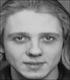

# Reconhecimento facial utilizando PCA e kNN

**Autor: Marcus Moresco Boeno**

**Último Update: 2020-12-24**


Algoritmo de reconhecimento facial desenvolvido como atividade final da disciplina de Aprendizado de Máquina II (Aprendizado Não-Supervisionado) da Pós-Graduação em Data Science da FURB (Universidade Regional de Blumenau).

O repositório contem um algoritmo de reconhecimento facil, utilizando PCA e kNN, seguido de um experimento avaliando sua performance no reconhecimento facial em imagens disponibilizadas pelo Olivetti Research Laboratory (ORL) da AT&T Laboratories Cambridge.

# Índice
---
1. [Dataset](#dataset)
2. [Algoritmo e Experimento](#algoritmo-e-experimento)
3. [Tecnologias Utilizadas](#tecnologias-utilizadas)
4. [Executando o Algoritmo](#executando-o-algoritmo)
    - [Opção 01: Docker Container](#opção-01-docker-container)
    - [Opção 02: Ambiente Virtual](#opção-02-ambiente-virtual)
5. [Resultados do Experimento](#resultados-do-experimento)


# Dataset
[Voltar ao topo](#índice)

O dataset utilizado é composto por 400 imagens capturadas entre 1992 e 1994 pelo Olivetti Research Laboratory (ORL) na AT&T Laboratories Cambridge. As imagens são relativas a 10 indivívuos, sendo que cada imagem foi capturada com alguma variação, como expressão facial e iluminação da sala. As imagens utilizadas possuem dimensões de 70x80 e estão configuradas como escala de cinza 8-bits (0-255). 

Abaixos seguem alguns exemplos, sendo que o dataset completo pode ser encontrado na pasta `imgs/orl`.





De forma complementar foram adicionadas 10 novas imagens ao dataset. As imagens adicionais também possuem dimensões 70x80 e estão armazenadas como escala de cinza 8-bits (0-255).

Abaixos seguem alguns exemplos, sendo que as imagens adicionais podem ser encontradas na pasta `imgs/me`.


Durante o processo de treinamento e classificação, o dataset contendo as 410 imagens é separado em conjuntos de treino e teste utilizando a técnica de Holdout em uma abordagem estratificada. Das 410 imagens, 70% são destinadas ao conjunto de treino e 30% ao conjunto de teste. A separação em subconjuntos de treino e teste permite a avaliação da acurácia do reconhecimento facial.

# Algoritmo e Experimento
[Voltar ao topo](#índice)


O algoritmo de reconhecimento facial tem como base a redução da dimensionalidade das imagens, por meio da técnica multivariada _Principal Component Analysis_ (PCA), seguida por uma classificação supervisionada utilizando o algoritmo _k-Nearest Neighbors_ (kNN).

Em seguida, foi construído um rápido experimento utilizando a técnica Holdout estratificada para o acompanhamento da evolução da acurácia do modelo em função da variação do número de dimensões utilizadas para o reconhecimento facial.

Desta forma a atividade está dividida em três etapas: (i) Treinamento; (ii) Predição e (iii) Experimentação. 

As etapas de treinamento e predição estão envolvidas com a construção do algoritmo, enquanto a etapa de experimentação está ligada à avaliação do mesmo.

O esquema geral apresentado abaixo, indica os passos de cada etapa.

1. Etapa de treinamento:
    - Geração da imagem média;
    - Normalização das imagens de treino a partir da imagem média;
    - Cálculo da matriz de covariância;
    - Cálculo dos autovalores e autovetores;
    - Geração das k-eigenfaces (pesos para transformação linear);
    - Normalização L2 para cada eigenface;
    - Projeção das imagens de treino para o novo espaço k-dimensional.

2. Etapa de predição:
    - Normalização da nova imagem a partir da imagem média;
    - Projeção da nova imagem para o novo espaço k-dimensional;
    - Determinação do vizinho mais próximo (imagem de treino) por meio da distância euclidiana (kNN);
    - Reconhecimento facial de acordo com a label (classe) do vizinho mais próximo.

3. Experimento:
    - Separação do dataset em subconjuntos de treino e teste;
        - Holdout estratificado (70% treino, 30% teste).
    - Treinamento e validação (cálculo da acurácia) para k (número de componentes principais) variando de 10 até 20.


A pasta `src` contem os códigos fonte responsáveis pelo reconhecimento facial. O processamento é realizado pelas classes `FaceImage` e `FaceRecognizer`, sendo que estes podem ser adaptados para outros contextos como o reconhecimento de plantas e animais.

Por sua vez o arquivo `./face_reckon.py` é responsável pela estruturação de um pequeno experimento que visa aplicar o reconhecimento facial sobre imagens dos datasets presentes na pasta `imgs`.

# Tecnologias Utilizadas
[Voltar ao topo](#índice)

O algoritmo de reconhecimento facial foi construído em um ambiente Windows, utilizando Python 3 e Docker.

Abaixo segue uma lista com as biblitecas Python utilizadas:
    
1. `Built-in`:
    - `os`: Interface com o sistema operacional;
    - `math`: Métodos de matemática básica;
    - `random`: Geradores aleatórios.
    
2. `numpy 1.19.3`:
    - Manipulação de matrizes e vetores (numpy.array);
    - Cálculo de autovalores e autovetores (numpy.linalg.eig).
    
3. `matplotlib 3.3.3`:
    - Leitura e escrita de imagens jpeg (matplotlib.image)

# Executando o Algoritmo
[Voltar ao topo](#índice)

O algoritmo pode ser executado por meio de um docker container ou de um ambiente virutal para o python. Abaixo segue um passo a passo para as duas opções.

## Opção 01: Docker Container
[Voltar ao topo](#índice)

---

Para executar a aplicação em um docker container, basta seguir três etapas:

1. Ative o docker em sua máquina;

2. Abra um novo terminal e navegue até a raíz do repositório clonado;

3. Execute a rotina.
```shell
> docker-compose run face-recognition
```

## Opção 02: Ambiente Virtual
[Voltar ao topo](#índice)

---

Como alternativa ao docker, é possível criar um ambiente virtual para o python seguindo os passos:

1. Abra um novo terminal e navegue até a raíz do repositório clonado;

2. Crie e ative um novo ambiente virtual chamado "venv";
```shell
> python -m venv venv
> .\venv\Scripts\activate
```

Caso esteja utilizando o PowerShell lembre-se de ajustar a política de execução de scripts para `RemoteSigned`, assim o shell permite a ativação do ambiente virtual criado
```shell
> Set-ExecutionPolicy -ExecutionPolicy RemoteSigned -Scope LocalMachine
```

3. Instale as dependências por meio do arquivo "requirements.txt";
```shell
> python -m pip install -r requirements.txt
```

4. Execute a rotina.
```shell
> python .\face_reckon.py
```

# Resultados do Experimento
[Voltar ao topo](#índice)

Abaixo segue uma execução completa do experimento, indicando a evolução da acurácia em função do aumento no número de componentes principais (de 10 até 20) utilizadas pelo classificador.

```
❯ python .\face_reckon.py
10 componentes principais, acurácia: 88.62%.
11 componentes principais, acurácia: 89.43%.
12 componentes principais, acurácia: 90.24%.
13 componentes principais, acurácia: 91.87%.
14 componentes principais, acurácia: 91.06%.
15 componentes principais, acurácia: 91.87%.
16 componentes principais, acurácia: 92.68%.
17 componentes principais, acurácia: 95.12%.
18 componentes principais, acurácia: 94.31%.
19 componentes principais, acurácia: 94.31%.
20 componentes principais, acurácia: 94.31%.
```

Observando os resultados acima, podemos perceber que a acurácia no reconhecimento das faces do conjunto de teste apresenta melhora com a adição de novas componentes principais.

O output acima é o default do experimento construído, sendo que o mesmo pode ser alterado por meio da manipulação do arquivo base `./face_reckon.py` presente na raíz do repositório.